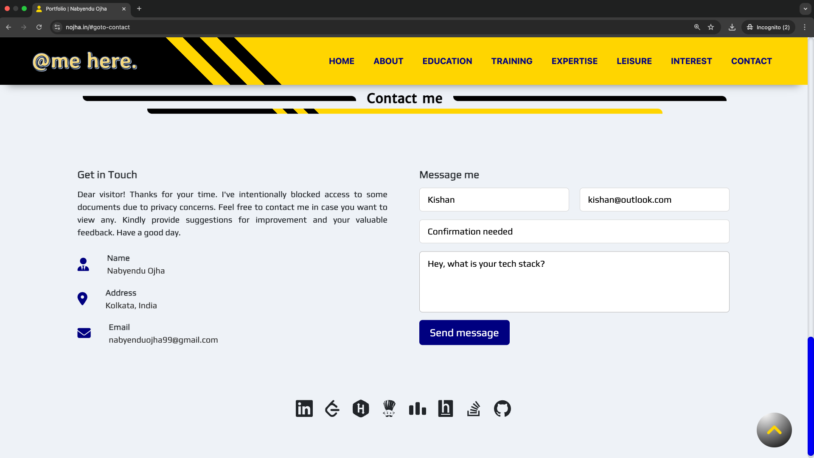
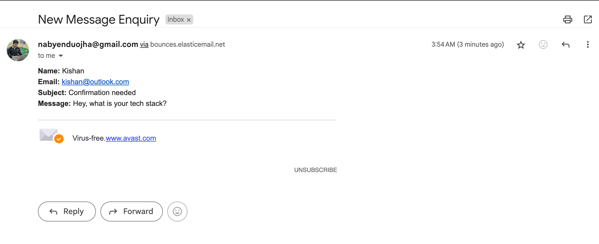

# portfolio.github.io

This is my portfolio website. This is my first website as well. I have acquired some knowledge on HTML, CSS and JavaScript surfing the internet and it is the outcome of that only. If you have any suggestion regarding its improvement, I will be happy to hear that. Thanks for your time.

### Important Features

1. AI Chat Window

   This is built using openrouter API with openai/gpt-3.5-turbo model and personalised prompt is added so that it can answer questions on behalf of me.
   
   

2. Email Contact Form

   This is built using SmtpJS and ElasticEmail. Once user will fill the details and submit, a notification will confirm that the email is sent successfully and the message will reach to my mail.

   

   

   
